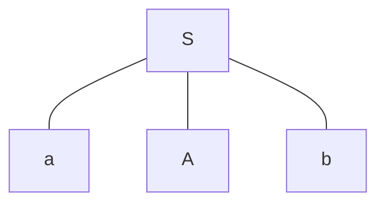
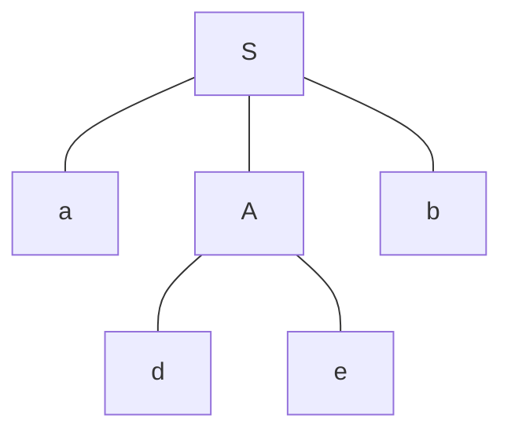
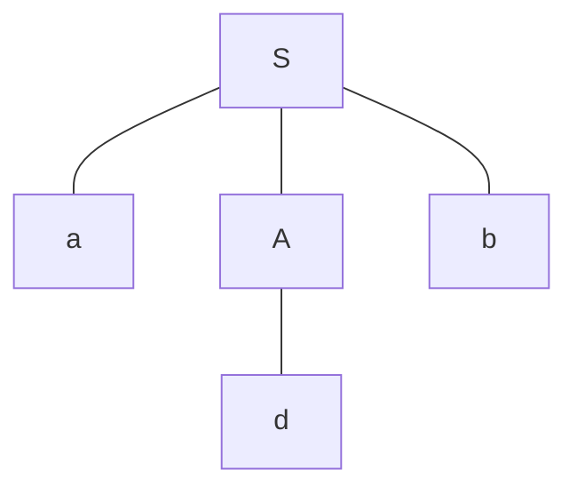

## 语法分析的方法

### 自上而下分析法

基本思想：对任何输入串，试图用一切可能的方法，从文法的开始符号出发，反复使用各种产生式，寻找匹配的推导。

方法：反复把产生式的左部符号替换成右部，从数根开始构造语法树。**寻找一个最左推导。**本质上是一个穷举过程。

#### 例子 
文法$G\left[S\right]$：
$$
\begin{aligned}
S &\rightarrow aAb	\\
A &\rightarrow de|d
\end{aligned}
$$

对于输入串$W=adb$，从左到右地匹配。
1. 首先输入流指针指向第一个字符$a$，以开始结点$S$构造语法树，如下。（hexo显示mermaid还要装插件，懒得弄了）

2. 此时最左子节点是终结字符$a$，与输入流指针指向的字符相同。因此该指针指向下一个字符$d$。
3. 对于下一个结点$A$，它是一个非终结字符，它会产生两颗语法树。如图：

4. 先选择第一棵语法树，$d$和$d$匹配，输入流指针再次转移到下一个字符$b$。而$b$和语法树中的字符$e$不一致，匹配失败。
5. 因为第一棵语法树失败了，因此要回溯，选择第二课语法树。输入流指针重新指向第二个字符$d$。
6. 和之前一样，指针指向的字符$d$和语法树中的$d$匹配，指针指向下一个$b$。而$b$也和语法树中的第三个子节点$b$相匹配，此时语法树的子节点也被遍历完了，匹配成功。$W=adb$确实是文法的句子。

#### 自上而下的问题
自上而下本质上是最左推导的穷举方法，还带**回溯**，效率极低，因此在使用自上而下分析法的时候，需要对文法有一定的限制：**无左递归**和**无回溯**。

#### 为什么需要消除左递归？
显然，左递归会引起死循环。

#### 左递归的消除

如果文法中存在推导$A\stackrel{+}{\Rightarrow}A\alpha$，则存在左递归。可以直接对左递归的规则进行等价变换。

若存在非终结字符的直接左递归规则：
$$
A \rightarrow A\alpha|\beta
$$
其中，$\alpha$是任意符号串，而$\beta$不以$A$开头，则可以写成等价右递归：
$$
\begin{aligned}
&A \rightarrow \beta A^{'}\\
&A^{'} \rightarrow \alpha A^{'}|\epsilon
\end{aligned}
$$
对于一般情况：
$$
A \rightarrow A \alpha_{1}|A \alpha_{2}|\dots|A \alpha_{m}|\beta_{1}|\beta_{2}|\dots|\beta_{n}
$$
可以写成：
$$
\begin{aligned}
&A \rightarrow \beta_{1}A^{'}|\beta_{2}A^{'}|\dots|\beta_{n}A^{'}\\
&A^{'} \rightarrow \alpha_{1}A^{'}|\alpha_{2}A^{'}|\dots|\alpha_{m}A^{'}|\epsilon
\end{aligned}
$$
可以进一步写成：
$$
\begin{aligned}
&A \rightarrow A^{''}A^{'}\\
&A^{''}\rightarrow \beta_{1}|\beta_{2}|\dots|\beta_{n} \\
&A^{'} \rightarrow A^{'''}A^{'}|\epsilon \\
&A^{'''} \rightarrow \alpha_{1}|\alpha_{2}|\dots|\alpha_{m}
\end{aligned}
$$

#### 回溯消除

为什么会产生回溯？因为在遇到非终结字符挑选候选式的时候，可能会有多个候选式符合要求。具体有两种情况：
1. 相同左部的**规则**，产生式右部左端的第一个终结字符相同。
2. 相同左部的**规则**，其中某一个右部能够推出$\epsilon$，在从开始符号$S$的某一个推导中，左部非终结字符的后继符号与其某一个规则的右部的左端相同。

为了解决这些问题，定义了一些三个特殊集合。

##### FIRST集合
若$G$是一个不含左递归的文法，对$G$的任意一个符号串$\alpha$，定义其$FIRST$集合。
$$
FIRST\left(\alpha\right):=\left\{s|\alpha\stackrel{*}{\Rightarrow}s\dots \land s \in V_{T} \right\}
$$
若$\alpha\stackrel{*}{\Rightarrow}\epsilon$，规定$\epsilon \in FIRST\left(\alpha\right)$。

##### FOLLOW集合

假设$S$是文法$G$的开始符号，对于$G$中任意非终结字符$A$，定义其$FOLLOW$集合。
$$
FOLLOW\left(A\right)=\left\{\alpha|S\stackrel{*}{\Rightarrow}\dots A\alpha\dots \land \alpha \in V_{T}\right\}
$$
若$S\stackrel{*}{\Rightarrow}\dots A$，规定$\$ \in FOLLOW\left(A\right)$。

##### SELECT集合 

对于文法中任意一条规则$A\rightarrow \alpha$，定义$SELECT$集合。
$$
SELECT\left(A\rightarrow \alpha\right)=

\begin{cases}

FIRST\left(\alpha\right)&\text{if $\alpha \cancel{\stackrel{*}{\Rightarrow}} \epsilon$}\\

\left(FIRST(\alpha)-\left\{\epsilon\right\}\right)\cup FOLLOW\left(A\right)&\text{if $\alpha {\stackrel{*}{\Rightarrow}} \epsilon$}

\end{cases}
$$

#### LL(1)文法的条件

当且仅当，文法中对每个非终结符$A$的任意两个不同的规则，其$SELECT$集合不**相交**。对于LL(1)文法，可以用自上而下的递归方法进行分析，且不存在回溯和死循环。

### 自下而上分析法
基本思想

