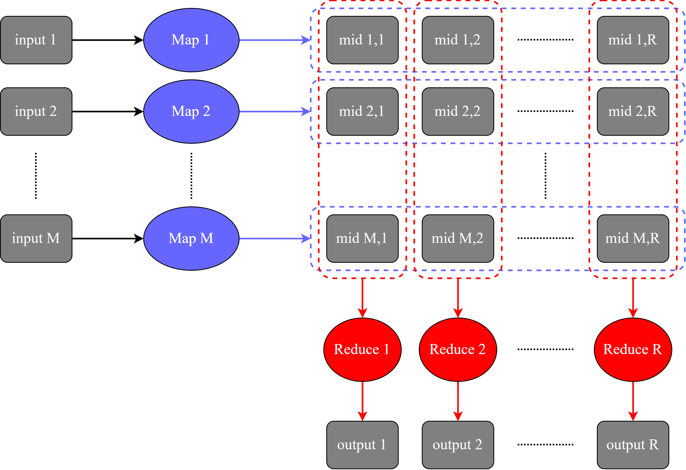

6.824 lab1 的 notes。

<!--more-->

## MapReduce

简言之，MapReduce 是一种 programming model。

### Map 和 Reduce

输入是一个 KV 集合，输出也是一个 KV 集合，用户可以自行实现 Map 和 Reduce。

- Map 接收一个 KV `<k1,v1>` 作为输入，输出一个 KV 集合 `list(<k2, v2>)`，集合被称为 intermediate KV pairs；
- 对 intermediate 中相同 key 的数据进行聚合，这一步称为 Shuffle；
- 将 Shuffle 好的数据传给 Reduce，每一个 `<k2, list(v2)>` 最终将映射到另一个集合 `<k2, v3>`。

```
map: <k1,v1> -> list(<k2,v2>)
shuffle: list(<k2, v2>) -> list(<k2, list(v2)>)
reduce: <k2,list(v2)> -> <k2, v3>
```



1. 将输入数据分割为 M 个 splits；
2. 一共有 M 个 map 任务和 R 个 reduce 任务；
3. 如果一个 worker 被分配了一个 map 任务，那它会读取特定的那个 split ，从数据中提取出 KV 对集合传输给用户定义的 `Map` 函数，`Map` 函数产生的 intermediate KV 对存在内存缓冲区中；
4. 内存缓冲区中的 intermediate 数据会被周期性写到磁盘上并被分割为 R 个 intermediate；
5. 如果一个 worker 被分配了一个 map 任务，会通过 RPC 读取该任务对应的 intermediate data，并调用 `Reduce`；
6. master 负责指派、协调 map worker 和 reduce worker。

### Google 的 MapReduce Implementation

1. 机器大多是 x86 架构，跑 Linux ，内存 2-4 GB；
2. 商用网络，通常是 100 Mb/s 或者 1Gb/s；
3. 一个集群有上百或者上千个机器，出故障很正常；
4. 用便宜的 IDE 硬盘直接保存每个机器自己的数据，用内部开发的分布式文件系统来管理文件；
5. 用户向一个调度系统提交 jobs ，每个 job 是一个 task 集合，由调度系统来分配到集群中的可用机器上。

## 6.824 lab1

一些自己的思路。

- master 管理 task 的状态，M 个 mapTask 和 R 个 reduceTask；
- 整个过程分为 2 个 phase，mapPhase 和 reducePhase，因为 reduceTask 需要从每个完成的 mapTask 中的部分数据进行 shuffle；
- master 在 assign task 给 worker 后启动定时器，如果时间耗尽时该 task 还未完成，该 task 变回 unassigned 状态；
