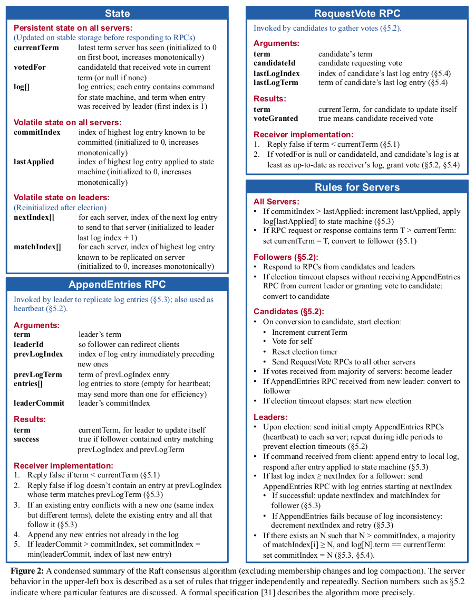

2023.02.05 update: 实际上这个 lab 我做的复杂了，不一定需要用条件变量。

2024.07.21 update: 从现在的经验上看，用多线程或者 goroutine 是很危险的事情。
<!--more-->

## Raft

Raft 是简化版的、工程化的 Paxos，分成了 Leader election、Log replication 和 Safety 三个相对独立的模块。

[Extended Raft paper](https://pdos.csail.mit.edu/6.824/papers/raft-extended.pdf) 详细阐明了 Raft 的逻辑，6.824 的 2A、2B 和 2C 都可以用 paper 里的 Figure 2 来概括。



### Leader election

1. 每一个 server 都有内部的 term （从 1 开始）和投票状态 `votedFor`。term 在 Raft 中是一个非常特殊的状态变量，对于某一个 server 来说，只有在**在一定时间没有收到 leader 的 heartbeat** 后（包括出现 split votes 的情况下），才会引发 term 的自增，而 term 的自增总会伴随着一阵新的 election。
2. 每一个 candidate 向 peer 发送 `RequestVote` 后，如果得到了超过半数的 votes，便会转化为 leader。自此，该 server 会尝试着维持现在的 term，并作为 leader 周期性 heartbeat followers。
3. 当 follower 收到某个 leader 的 heartbeat 后，如果（在这个 RPC 中）该 leader 的 term 比自己的 term 小（这意味着该 leader 不应该再是 leader，因为一定存在一个 server 已经自增 term 并尝试成为新的 leader），此时需要将该信息 response 给该 leader，让其退化为 follower。**这里的该 leader 的真实状态不一定真的是 leader，因为可能存在网络延迟的问题，这个 heartbeat RPC 被推迟送达。**
4. 当某个 leader 的 heartbeat 信息中的 term 大于等于 follower 的 term 时，follower **无条件**认可该 leader 的信息。可能会觉得 follower 的行为过于被动，但是 follower 用 **term** 对 leader 的 check 本身就保证了安全性。**对于每一个 follower 本身来说，只要 leader 的 term 至少比我的 term 大，那它的状态便是超前于我的，我便可以接受它的指令，即使它现在可能早就不是 leader 了。**
5. Raft 采用 random election timeouts 来避免 split votes。

### Log replication

1. 每一个 leader 需要维护 peers 的 matchIndex 和 nextIndex 状态。
   1. 每一个 heartbeat RPC 里携带了需要给该 follower 同步的 log entries，在 [Extended Raft paper](https://pdos.csail.mit.edu/6.824/papers/raft-extended.pdf) 里每个 RPC 只有一个或者零个（pure heartbeat），但是在 6.824 lab2C 里会优化这个机制，让每个 RPC 携带多个 entries，提高效率。**而对于每个 follower 来说，其 heartbeat RPC 里要放哪些 entries，取决于该 leader 为其维护的 nextIndex。**
   2. 当某个 heartbeat 携带了 entries 并得到了对方 follower 的肯定回复时，该 leader 便可以断定该 follower 已经同步了 heartbeat 中涵盖的 log 信息，也就是，完成了 replication，此时可以修改该 follower 的 matchIndex 和 nextIndex。
   3. 每一个 heartbeat RPC 都包含着发送该 RPC 的 leader 认为该 follower 当前所需要同步的 entry index。显然这并不是任何时候都成立的，因此，对于某个 follower，假如该 heartbeat 是合法的（term checked），但是 leader 搞错了 follower 实际需要的 entry index，follower 便会返回 `false`，让 leader 去修正其为该 follower 维护的 nextIndex，**直到被 follower 肯定回复**。
   4. 在某个 server 刚刚转化为 leader 时，初始化每个 follower 的 matchIndex 为 `0`，并初始化每个 follower 的 nextIndex 为 `nextLogIndex`。每一个 server 的 `nextLogIndex` 是该 server 下一个 potential log entry 的 index。
2. 每一个 server 都需要维护 commitIndex 和 lastApplied。commitIndex 表示：到 commitIndex 之前，所有的 log entry 都被该系统中的 majority 所认可，可以直接放心作用于状态机；lastApplied 表示当前真正已经被作用于状态机（这个动作称为 apply）的最后一个 entry 的 index。
   1. 对于 leader 来说，由于外部（上层应用的）entry 只能被 leader 所接受，而也只有 leader 会尝试将 entry 同步给 followers，因此 leader 会在某些 entry 被大部分机器所承认时，**主动**修改 commitIndex（在这里，这些 entry 被成为**被 commit** 了。），并将其作为 heartbeat RPC 的一部分信息同步给 followers；
   2. 对于 follower 来说，所有对 commitIndex 的修改都源自于 leader 的 heartbeat。在一般情况下，当 leader 的 commitIndex 大于自身的时，便同步成 leader 的。
   3. 每一个 server 都需要检查自身的 commitIndex 和 lastApplied，当前者大于后者时，便意味着有事情做了，可以把一些 entry 给 apply 掉了。

### Safety

Leader election 和 log replication 显然是需要某些约束才能保证 Raft 的正确性的。[Extended Raft paper](https://pdos.csail.mit.edu/6.824/papers/raft-extended.pdf) 中笼统概括了一些 Safety properties，但是在写 lab 的时候，其实有更多的细节需要去考虑到。

1. 首先，当所有的 RPC 中包含的 term 小于 server 自身的 term 时，忽略它，或者是返回 `false`（如果有）。
2. 当一个 candidate 向其他 server requests votes 时，对于某一个特定的 server，只有该 candidate 的 log 与它自己的 log 相比 **least as up-to-date** 时，才会给予 vote。Log 之间的 up-to-date 是一个非常微妙的比较关系，参考 paper 第 8 页。
3. Leader 绝对不可以 commit 不是当前 term 的 entry，即使它确实已经被集群 majority 所共识。该性质解决了 paper 中 Figure 8 阐述的问题，简单来说便是，如果 leader 可以随意 commit 任意被集群多数所共识的 entry，会产生某个 index 的 entry 被 apply 多次的灾难现象，而这是绝对不允许的。[这篇知乎文章](https://zhuanlan.zhihu.com/p/369989974)详细解释了 Figure 8，并使用了一个 no-op 来解决这个问题，我最后的代码实现并没有采用额外的 no-op 来做这件事，而是**在 leader 尝试进行 commitIndex 前，进行额外的 term 对比**，假如该 leader 只能找到不是当前 term 的、但是被多数机器所认可的 entry，便**不修改 commitIndex**。

## 6.824 lab2

即使看懂了 paper 里 election、replication 和 safety 的三块阐述，编写 lab2 时还是会出现各种各样的奇怪 bug，我最后的版本在连续跑了 800 次 test 后没有报错，提一些细节处理。

1. 控制锁的粒度，就像 [6.824 助教说的](https://www.youtube.com/watch?v=UzzcUS2OHqo&list=PLrw6a1wE39_tb2fErI4-WkMbsvGQk9_UB&index=5)一样，千万不要用很多小锁来保护各种各样的 shared data，锁的粒度太小时跟没有锁是一样的。**锁的终极目的，并不是为了保护 shared data 的原子读写，而是让某些代码（某些行为）连续发生，因此要站在程序运行的角度上去考虑锁的用处。**
2. 尽量用一把大锁去保护临界区，控制并发的力度，可以先从不并发的串行程序开始，小心慢慢提高并发的力度。并发的力度太大会导致很多难以理解的行为，个人建议只需让“真正发送 RPC” 这件事（也就是调用 Call）并发化，会减少很多问题的产生。
3. `votedFor` 这个变量需要额外小心，它需要一个 default value（比如 `-1` ）。
   1. 根据 Figure 2 和 [Raft 演示](https://raft.github.io)，当 follower 做出投票行为时，需要修改 `votedFor`；
   2. 在 server 收到 RequestVote RPC 时，如果它在先前已经投票给了一个 server，而此时新的 candidate 的 term 更超前时，首先要修改 `votedFor` 为 default value（意味着回到没有给出投票的状态）；
   3. 在 server 接收 leader 的 heartbeat 时，如果该 server 先前没有投票给该 leader，set `votedFor` to default value。拍脑袋一想，会觉得这是没有必要的，因为 2 已经保证了 election 开始时，server 会检查 term 重置 `votedFor`，但在网络不稳定的 Figure 8 的情况下，会更容易产生谁都选不上的活锁；
   4. 在所有的 RPC 调用之后，需要检查 reply 中的 term，如果对方的 term 比自己还要超前，便退化为 follower，退化时也要 **set `votedFor` to default value**。
4. 在 leader 真正发送 heartbeat RPC 和 candidate 真正发送 `ReuqustVote` 之前（调用 labrpc 中 Call 方法前），检查当前 go routine 是否已经过期。举个例子，因为调度器的原因，某个过期 leader 的 heartbeat routine 在它被其他 leader heartbeat 后才刚刚被调度运行，而此时的 term 已经超前于创建该 routine 时候的 term，需要设计一个机制来过滤这样的过期 routine（在创建时传入当前 term）；
5. 用多个 routine 对 commitIndex 和 lastApplied 进行监控，用条件变量进行 routine 之间的通信；
6. 对 nextIndex 定位的优化可以参考 [6.824 助教的文章](https://thesquareplanet.com/blog/students-guide-to-raft/)，这篇文章也提到了许多实现 Raft 时需要注意的细节。要注意，这篇文章假定了 log entry 的 index 从 0 开始，如果你和我一样严格遵守 Figure 2 让 entry index 从 1 开始，需要自己在其思路上额外做一些修改，**并且在完成 lab2D Snapshot 部分时，也需要针对该 optimization 再处理一些额外的边界条件**；
7. 在发送 apply entry 时（发送 ApplyMsg 给 channel 时），需要注意**锁**。一个推荐的行为是，在等待 channel 消费 ApplyMsg 时把锁释放，换句话说，在 `rf.applyCh <- msg` 前把锁释放，否则在 2D 有可能会产生无限等待的死锁情况（这个死锁还不会被检测到）。

最终实现的版本的测试结果的 time consuming、RPC numbers 可以参考：
```bash
➜  raft git:(master) ✗ go test -race
Test (2A): initial election ...
  ... Passed --   3.0  3   74   24538    0
Test (2A): election after network failure ...
  ... Passed --   4.5  3  156   31934    0
Test (2A): multiple elections ...
  ... Passed --   5.5  7  636  138233    0
Test (2B): basic agreement ...
  ... Passed --   0.7  3   16    5272    3
Test (2B): RPC byte count ...
  ... Passed --   2.0  3   48  116836   11
Test (2B): agreement after follower reconnects ...
  ... Passed --   5.8  3  156   48680    8
Test (2B): no agreement if too many followers disconnect ...
  ... Passed --   3.7  5  248   56540    3
Test (2B): concurrent Start()s ...
  ... Passed --   0.7  3   14    4602    6
Test (2B): rejoin of partitioned leader ...
  ... Passed --   4.2  3  182   44785    4
Test (2B): leader backs up quickly over incorrect follower logs ...
  ... Passed --  20.3  5 2256 1296886  102
Test (2B): RPC counts aren't too high ...
  ... Passed --   2.2  3   50   17328   12
Test (2C): basic persistence ...
  ... Passed --   4.0  3  112   31325    6
Test (2C): more persistence ...
  ... Passed --  16.6  5 1168  272848   16
Test (2C): partitioned leader and one follower crash, leader restarts ...
  ... Passed --   1.8  3   42   12032    4
Test (2C): Figure 8 ...
  ... Passed --  34.7  5 1528  341677   36
Test (2C): unreliable agreement ...
  ... Passed --   4.2  5  212   84694  246
Test (2C): Figure 8 (unreliable) ...
  ... Passed --  38.8  5 4064 7936640  209
Test (2C): churn ...
  ... Passed --  16.6  5  912  837728  251
Test (2C): unreliable churn ...
  ... Passed --  16.3  5  620  216412   50
Test (2D): snapshots basic ...
  ... Passed --   5.6  3  140   57416  220
Test (2D): install snapshots (disconnect) ...
  ... Passed --  62.2  3 1758  727536  308
Test (2D): install snapshots (disconnect+unreliable) ...
  ... Passed --  75.2  3 2098  838116  355
Test (2D): install snapshots (crash) ...
  ... Passed --  32.3  3  818  412298  335
Test (2D): install snapshots (unreliable+crash) ...
  ... Passed --  38.0  3  956  409544  268
Test (2D): crash and restart all servers ...
  ... Passed --  10.0  3  248   84358   53
PASS
ok      6.824/raft      410.052s
```